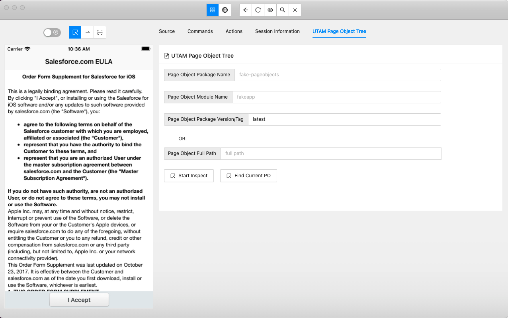
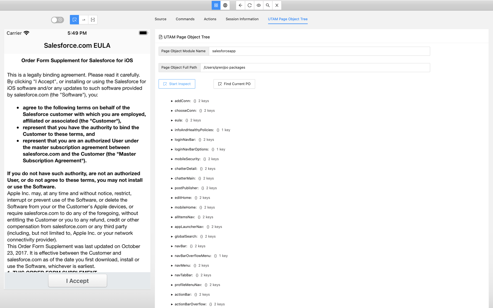
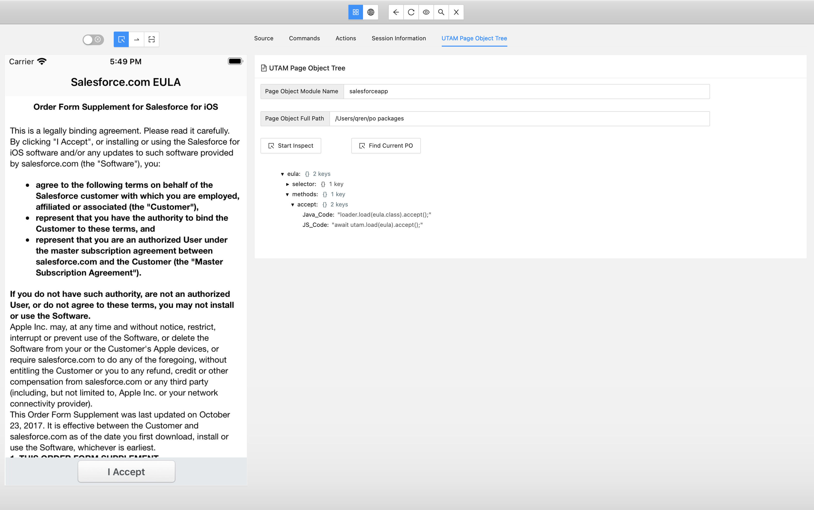

# Appium Inspector

# IMPORTANT NOTE

This project is a fork of the official [appium-inspector](https://github.com/appium/appium-inspector)-project and holds a few Salesforce specific adjustments.

The biggest adjustment in this project is the ability to manually inspect the [UTAM](https://utam.dev/) [Page Object](https://www.npmjs.com/package/salesforce-pageobjects) that published by Salesforce to quickly find out the right Page Object(s) for the target page/component.

The reason why this became a fork instead of a new feature in the existing Appium Inspector is that, in consultation with the Appium core team, it was decided that it was better to not implement vendor specific features into Appium Inspector. We agreed that a fork would be the best way to go forward.

This fork will be updated with all new features/fixes of the original [Appium Inspector](https://github.com/appium/appium-inspector)-project so you can see this as a Salesforce specific replacement of the/your current Appium Inspector.

## Installation

Since this is just a standard Appium Inspector with Salesforce specific feature built on top of it, you can use the same [install instructions](https://github.com/appium/appium-inspector#installation) and launch it. 

## Inspect UTAM Page Object

After starting a new session with the test application, then navigate to the UTAM Page Object Tree Tab as shown here .

There are two ways that you can use to configure which Page Object library to inspect:

* Typing in the Page Object package name and module name in the Page Object Package Name and Page Object Module Name fields, for exmaple, salesforce-pageobjects for package and salesforceapp for module for SalesforceApp application. Then, you can give in the target Page Object version you want to use, for example, 1.0.0. If you don't configure any value for it, then the default value: latest will be used. Instead of using package version, you can also use the release tag, for example, winter23, summer22 etc.. 

* Besides to inspect the published Page Objects from NPM site, you can inspect the one that you build locally. In this way, you should configure the Page Object Full Path field that point to your local Page Object package. For exmaple, I have a local package communities-pageobjects-240.0.5.tgz at: ${Home}/jars/, after unzipping it, put its full path value, for example, ${Home}/jars/package/utam-communities-pageobjects. 

Now, you can start inspect via clicking Start Inspect button to find out all avaialbe Page Objects for the test device platform (iOS or Android) in the configured package. 

Utill to this step, you can start to work your target page/component via navigating test applicaton on your local simulator or emulator, then you can find out the UTAM Page Object(s) for the current page via clicking Find Current PO button. Inspector helps to find out all matched root Page Object and children Page Objects. Moreover, it exposes all methods (both for Java and JavaScript) that to interact with the element(s) on the page for test script. 
